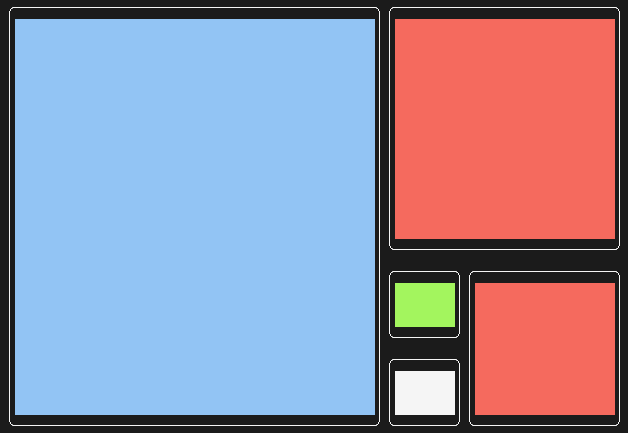

# fclock

Fibonacci clock in terminal.

## Dependencies

If you have rust installed your are ready to go.

If not, you will need rust package manager [cargo](https://github.com/rust-lang/cargo/).

## Installation (Linux)

Read Makefile before running to make sure it will work for your OS!

1. Copy this repo:

    ```shell
        git clone https://github.com/Pavel-N/fclock.git
    ```

2. Run Makefile

    ```shell
        make install
    ```

### Uninstallation

```shell
    make uninstall
```

## How to read the clock?

The fibonacci clocks are made up from 5 blocks going in a spiral according to the [Fibonacci sequence](https://en.wikipedia.org/wiki/Fibonacci_number). Starting with the "5 block", then the "3 block", "2 block", "1 block" and another "1 block".

Every block can have 4 colours - Red, Green, Blue and White:

- **Red** blocks = **Hours**
- **Green** blocks = **Minutes**
- **Blue** blocks = Both **hours** and **minutes**
- **White** blocks = Nothing

### Let's try it on an example



For **hours** we will sum up the **red** and **blue** blocks:
> 5 + 3 + 2 = 10

**NOTE:** We also need to remeber that clocks can only show time in 12-hour format, because the sum of all blocks is 12 (5 + 3 + 2 + 1 + 1 = 12)

For **minutes** we will sum up the **green** and again **blue** blocks:
> 5 + 1 = 6

Because the clocks can only show numbers from 0 to 12. The minutes are divided into increments of 5.

That means we need to multiply minutes we counted (6) by 5.
> 5 + 1 = 6 => 6 * 5 = 30

**NOTE:** This obviously also means that the precision of these clocks is 5 minutes (10:00 -> 10:05 -> 10:10 -> ...)  
I have set it up to round XX:02 down to XX:00 and XX:03 up to XX:05 and so on.

Now we have our result: **10:30**

## Inspired by

I have been inspired by [this project](https://www.instructables.com/The-Fibonacci-Clock/) by user [pchretien](https://www.instructables.com/member/pchretien/), he covers and explains the clocks even better than this README.
